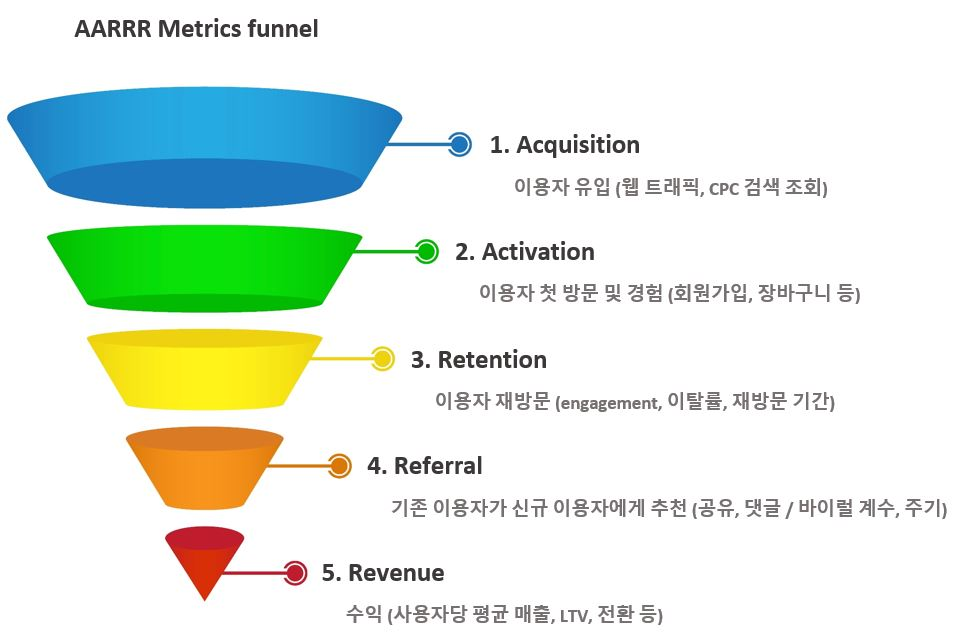

# 🦁 TIL

## ✅ Online Retail, Business Data
* 오가닉 트래픽(Organic Traffic)
  * 광고나 소셜미디어, 리퍼럴 사이트와 같은 채널을 통해 사이트로 유도되는 트래픽을 제외하고 검색 엔진을 통해 곧바로 유입되거나 동일한 도메인 안에서 유입되는 트래픽

 

### - AARRR
* 시장 진입 단계에 맞는 특정 지표를 기준으로 우리 서비스 상태를 가늠할 수 있는 효율적인 기준
* `Acquistion`, 첫 방문
  * 어떻게 우리 서비스를 접하고 있는가
* `Activation`, 첫 회원가입
  * 사용자가 처음 서비스를 이용할 때 긍정적인 경험을 제공하는가
* `Retention`, 재구매
  * 이후의 서비스 재사용률을 어떻게 되는가
* `Referral`, 친구 소개
  * 사용자가 자발적 바이럴, 공유를 일으키고 있는가
* `Revenue`, 첫 구매
  * 최종 목적(매출)으로 연결되고 있는가

  
[출처](https://21ctheageofdiscovery.com/161)

 

### - 코호트 분석(Cohort analysis)
* 분석 전에 데이터 세트의 데이터를 관련 그룹으로 나누는 일종의 행동 분석
* 이러한 그룹은 일반적으로 정의된 시간 범위 내에서 공통된 특성, 경험 공유
* 회사는 고객이 겪는 자연적 주기를 고려하지 않고 모든 고객을 분할
* 고객의 수명 주기 전반에 걸친 패턴을 명확하게 볼 수 있음
* 시간 패턴을 보고 회사는 특정 집단에 맞게 서비스 조정 

 

### - RFM
* 가치있는 고객을 추출해내어 이를 기준으로 분류할 수 있는 분석 방법
* 구매 가능성이 높은 고객을 선정하기 위한 분석 방법
* `Recency`
  * 거래의 최근성
  * 고객이 얼마나 최근에 구입했는가
* `Frequency`
  * 거래 빈도
  * 고객이 얼마나 빈번하게 구입하는가
* `Monetary`
  * 거래 규모
  * 고객이 구입했던 총 금액은 어느 정도인가

