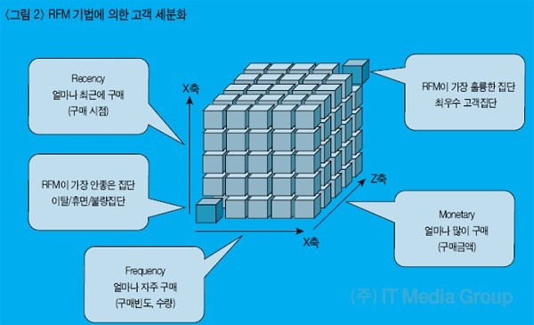

# 🦁 TIL

## ✅ Online Retail, Business Data
* 오가닉 트래픽(Organic Traffic)
  * 광고나 소셜미디어, 리퍼럴 사이트와 같은 채널을 통해 사이트로 유도되는 트래픽을 제외하고 검색 엔진을 통해 곧바로 유입되거나 동일한 도메인 안에서 유입되는 트래픽

<br>

### - AARRR
* 시장 진입 단계에 맞는 특정 지표를 기준으로 우리 서비스 상태를 가늠할 수 있는 효율적인 기준
* `Acquistion`, 첫 방문
  * 어떻게 우리 서비스를 접하고 있는가
* `Activation`, 첫 회원가입
  * 사용자가 처음 서비스를 이용할 때 긍정적인 경험을 제공하는가
* `Retention`, 재구매
  * 이후의 서비스 재사용률을 어떻게 되는가
* `Referral`, 친구 소개
  * 사용자가 자발적 바이럴, 공유를 일으키고 있는가
* `Revenue`, 첫 구매
  * 최종 목적(매출)으로 연결되고 있는가

 <br>
[출처](https://21ctheageofdiscovery.com/161)

<br>

### - 코호트 분석(Cohort analysis)
* 분석 전에 데이터 세트의 데이터를 관련 그룹으로 나누는 일종의 행동 분석
* 이러한 그룹은 일반적으로 정의된 시간 범위 내에서 공통된 특성, 경험 공유
* 회사는 고객이 겪는 자연적 주기를 고려하지 않고 모든 고객을 분할
* 고객의 수명 주기 전반에 걸친 패턴을 명확하게 볼 수 있음
* 시간 패턴을 보고 회사는 특정 집단에 맞게 서비스 조정 

<br>

### - RFM
 <br>
[조은님 추천 자료 & 사진 출처](http://www.itdaily.kr/news/articleView.html?idxno=8371)
* 가치있는 고객을 추출해내어 이를 기준으로 분류할 수 있는 분석 방법
* 구매 가능성이 높은 고객을 선정하기 위한 분석 방법
* `Recency`
  * 거래의 최근성
  * 고객이 얼마나 최근에 구입했는가
* `Frequency`
  * 거래 빈도
  * 고객이 얼마나 빈번하게 구입하는가
* `Monetary`
  * 거래 규모
  * 고객이 구입했던 총 금액은 어느 정도인가

<br>

* RFM 모형
  * Scoring 기법: RFM의 요인을 각각 5등급으로 등간격으로 분류하는 방법
  * 현재 개발된 RFM 모형은 크게 4가지로 분류 
  * 정설이 아니며 신뢰하기 어려움을 전제로 참고
    * 모델1. RFM 각 요소의 20% rule의 적용
    * 모델2. 비율 척도에 의한 양적인 정도의 차이에 따른 등간격의 5등급 분류
    * 모델3. 상하 20%를 제외한 등간격 척도에 의한 그룹 분류
    * 모델4. 군집 분석에 의한 각 요소 별 5개의 그룹 분류
  * Data Mining 기법을 이용한 모형
  * 회귀분석
  * 선형 회귀 분석을 이용한 모형
    * 고객의 구매 최근성, 구매 빈도, 구매 금액 등 고객의 수익 기여도를 나타내는 세가지 지표들의 선형결합으로 세가지 지표들을 점수화
  * 다중 회귀 분석을 이용한 모형
    * 각 고객의 구매 행동을 나타내는 R,F,M의 변수들을 독립변수로하고 고객의 미래 구매 행동을 예측하는 기법
  * 신경망을 적용한 모형
    * 로지스틱 회귀 모형을 보완하는 차원에서 연구
  * 확률적 RFM모형
    * Colombo와 Weina의 확률적인 RFM모형은 과거의 고객의 응답 이력으로 고객의 미래 응답을 예측하는 행동모델

<br>

* 파레토 법칙
  * 상위 고객의 20%가 기업 총 매출의 80%를 차지
  * 80:20 법칙을 고려하면 고객 매출 데이터가 누적됨에 따라 마케팅에 데이터를 활용해 마케팅에 활용
* 고객 세분화
  * 상품과 서비스 판매정보 - 상품판매 자료 거래 금액, 횟수
  * 인구통계학적 정보 - 나이, 성별, 직업, 학력, 거주지역, 소득수준
  * 라이프 스타일 정보 - 순차적, 구매 정보, RFM 정보
  * 심리 정보 - 구매욕구
  * 행동 정보 - 구매패턴 Life Time Value

<br>

### - 고객 분류
* `cut`
  * 절대 평가
  * 특정 기준을 넘는 고객과 못넘는 고객으로 분류
* `qcut`
  * 상대 평가
  * 기준보다 모든 고객 중 상대적으로 등급 부여
  * 같은 비율로 나누고자 한다면 사용
```python
# 1부터 10까지 3 묶음으로 나눠라
pd.qcut(range(1, 11), 3, labels=["high", "mid", "low"])

# 1부터 10까지 5 묶음으로 나눠라
pd.qcut(range(1, 11), 3, labels=range(1, 6))
```

[린 분석](https://www.slideshare.net/xguru/with-lean-analytics-with-lezhin-comics)<br>
[서비스 기획자를 위한 데이터 분석 시작하기](https://www.slideshare.net/leoyang991/ss-90038927) <br>
[토스 세션 영상](https://www.youtube.com/watch?v=GFERag7kjFM&list=PL1DJtS1Hv1Piv_MQIHgA_CdNsXyDM9UDM&ab_channel=%ED%86%A0%EC%8A%A4) <br>
[토스 세션 정리](https://brunch.co.kr/@ashashash/186) 

* R : 값이 작을 수록 높은 점수 : 최근에 왔는지를 보기 때문
* F : 값이 높을 수록 높은 점수 : 자주 왔는지를 보기 때문
* M : 값이 높을 수록 높은 점수 : 얼마나 많은 금액을 구매했는지 보기 때문

<br>

* dt.timedelta(days=1) : 날짜 연산
* 1을 더하는 이유
  * 마지막 영업일과 같은날 거래했다면 0이 아닌 1이 나오게 하기 위함
```python
last_timestamp = df["InvoiceDate"].max() + dt.timedelta(days=1)
```

* `groupby` 에서도 `lambda` 사용 가능
```python
df.groupby("CustomerID").agg({"InvoiceDate" : lambda x: (last_timestamp - x.max()).days , "InvoiceNo": "count"})
```

* `assign`
* 여러 변수를 한 번에 만들고 싶을 때 사용
```python
rfm = rfm.assign(R=r_cut, F=f_cut, M=m_cut)
```

<br>

## ✅ Online Retail EDA

* 메세지 삭제
  * 실제 비즈니스에서는 취소건에 업데이트를 하기보다 새로운 레코드를 하나 더 생성
  * 주문 - 취소가 짝이 되도록 만듦
  * 언제 주문이 일어났고 언제 취소가 되었는지 알기 위해 로그를 남기는 방식
  * 논리 삭제
  * 데이터가 사라지지 않는 장점
  * 단점
    * 삭제되지 않은 유효한 데이터를 조회할 경우 별도 조건 추가해줘야 하는
    * 보통 논리 삭제를 하되 데이터 분석에 활용되었거나 보유기간이 지난 데이터를 물리 삭제

* pandas의 `background_gradient()` vs seaborn의 `heatmap()`
  * pandas 의 background_gradient() : 변수마다 성질이 다를 때, 각 변수별로 스케일값을 표현
  * seaborn 의 heatmap() : 같은 성질의 변수를 비교할 때, 전체 수치데이터로 스케일값을 표현


* `ARPU(Average Revenue Per User)`
  * [위키 백과](https://ko.wikipedia.org/wiki/ARPU)
  * 가입한 서비스에 대해 가입자 1명이 특정 기간 동안 지출한 평균 금액
  * ARPU = 매출 / 중복을 제외한 순수 활동 사용자 수
* `ARPPU(Average Revenue Per Paying User)`
  * [네이버 백과](https://terms.naver.com/entry.naver?docId=2028542&cid=42914&categoryId=42915)
  * 지불 유저 1명 당 한 달에 결제하는 평균 금액을 산정한 수치

<br>

## ✅ Clustering
* 대표적인 비지도 학습 방법
* 주어진 데이터들의 특성을 고려해 데이터 집단(Cluster)을 정의하고 데이터 집단을 대표할 수 있는 대표점을 찾는 것이 목표
* Cluster
  * 비슷한 특성을 가진 데이터들의 집단
  * 데이터의 특성이 다르면 다른 클러스터에 속해야 함
* 효율성
  * Cluster 분석을 통해 수백만의 데이터를 직접 확인하지 않고 각각 Cluster의 대표값만 확인해 전체 데이터의 특성을 파악

|종류|매개변수|확장성|사례|알고리즘|
|:---:|:---:|:---:|:---:|:---:|
|K-Means|number of clusters|가장 큰 n_samples <br> n_clusters에 MiniBatch code|범용, 균일한 클러스터 크기 <br> 평평한 기하학, 유도성 <br> 클러스터가 너무 많지 않음|점 사이의 거리|
|Affinity propagation|damping, <br> sample preference|n_samples로 확장 불가능|많은 클러스터, <br> 고르지 않은 클러스터 크기 <br> 평평하지 않은 기하학, 귀납적|그래프 거리, <br> 가장 가까운 이웃 그래프|
|Mean-shift|bandwidth|n_samples로 확장 불가능|많은 클러스터, <br> 고르지 않은 클러스터 크기 <br> 평평하지 않은 기하학, 귀납적|점 사이의 거리|
|Spectral clustering|number of clusters|중형 n_samples <br> 소형 n_clusters|적은 수의 클러스터 <br> 클러스터 크기, 평평하지 않은 기하학, 변형|그래프 거리, <br> 가장 가까운 이웃 그래프|
|DBSCAN|neighborhood size|대형 n_samples <br> 중형 n_clusters|평평하지 않은 기하학 <br> 고르지 않은 클러스터 크기, 변형|가장 가까운 지점 간의 거리|

<br>

### - K-means
* 이상치에 예민
* 입력값
  * k : 클러스터 수
  * D : n개의 데이터 오브젝트를 포함하는 집합
* 출력값
  * k개의 클러스터
* 알고리즘
  1. 데이터 오브젝트 집합 D에서 k개의 데이터 오브젝트를 임의로 추출
  2. 데이터 오브젝트들을 각 클러스터의 중심으로 설정
  3. 집합 D의 각 데이터 오브젝트들에 대해 k개의 클러스터 중심 오브젝트와의 거리를 각각 구하고, <br> 각 데이터 오브젝트가 어느 중심점과 가장 유사도가 높은지 알아낸다. <br> 그렇게 찾아낸 중심점으로 각 데이터 오브젝트들을 할당 
  4. 클러스터의 중심점을 다시 계산. 3에서 재할당된 클러스터들을 기준으로 중심점을 다시 계산
  5. 각 데이터 오브젝트의 소속 클러스터가 바뀌지 않을 때까지 3, 4 반복
