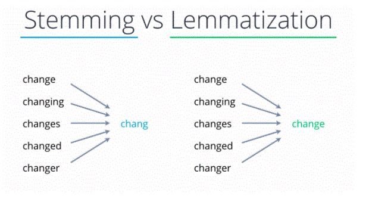
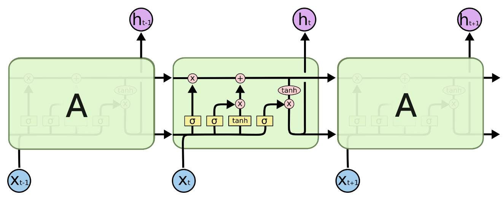
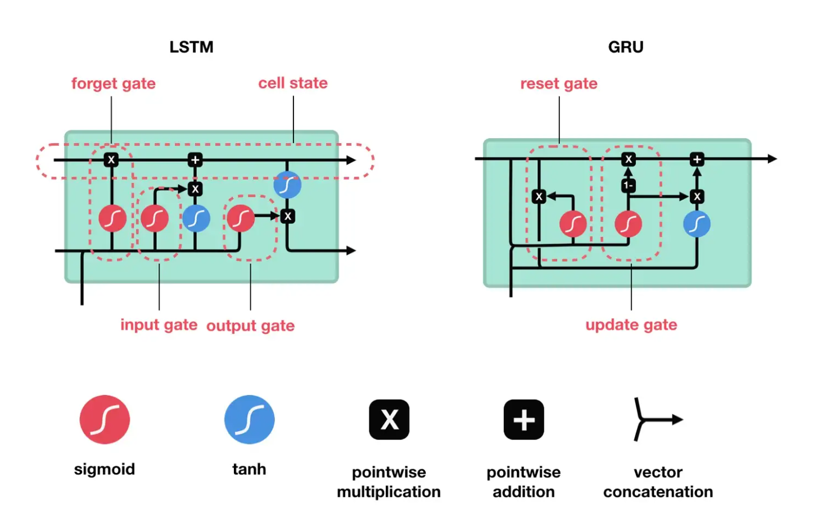

# 🦁 TIL
[딥러닝을 이용한 자연어 처리 입문](https://wikidocs.net/book/2155)
[AI 142가지 데이터셋](https://needleworm.github.io/dataset/)
[BLSTM 정은쓰 추천 자료](https://blog.naver.com/ssj860520/222820930221)

## ✅ Natural Language Processing, NLP
* 자연어 의미를 분석하여 컴퓨터가 처리할 수 있도록 하는 일
* 자연어(natural language) : 우리가 일상 생활에서 사용하는 언어
* 기계에게 인간의 언어를 이해시키는 인공지능의 한 분야

<br>

### - 자연어 처리로 할 수 있는 일
* 음성 인식, 내용 요약, 번역
* 사용자의 감성 분석
* 텍스트 분류 작업(스팸 메일 분류, 뉴스 기사 카테고리 분류)
* 질의 응답 시스템, 챗봇 등 

> 네이버 영화리뷰의 저작권 ➡️ 네이버는 데이터베이스권, 리뷰 작성자에게는 저작권

<br>

### - 자연어 분류 과정
* 데이터 나누기와 벡터화 과정은 바뀔 수 있음
* 데이터 로드 ➡️ 텍스트 데이터 전처리 ➡️ 텍스트 데이터 벡터화 ➡️ 데이터 나누기 ➡️ 학습
* 데이터 로드 ➡️ 텍스트 데이터 전처리 ➡️ 데이터 나누기 ➡️ 텍스트 데이터 벡터화 ➡️ 학습

<br>

### - 데이터 정제 및 전처리
* 이상치 과적합 방지
* 텍스트 정제 ➡️ 신호와 소음을 구분
1. HTML 태그, 특수문자, 이모티콘
2. 정규 표현식
   * 문자, 숫자, 특수문자를 제외할 때 주로 사용
   * 특정 패턴으로 텍스트 전처리 시 사용
   * 그 자체로 프로그래밍 언어 
3. 불용어, Stopword
   * 문장에 자주 등장하지만 "우리, 그, 그리고, 그래서" 등 관사, 전치사, 조사, 접속사 등의 단어로 문장 내에서 큰 의미를 갖지 않는 단어
   * 영어는 불용어 사전을 사용하나 한국어는 주제나 프로젝트에 맞게 만들어 사용
   * 데이터에서 유의미한 단어 토큰을 선별하기 위해 큰 의미가 없는 단어 토큰 제거 작업 필요
   * 언어 분류, 스팸 필터링, 감정 분석과 관련된 작업 중 하나인 경우 불용어 제거 추천
   * 기계 번역, 질문 답변, 텍스트 요약, 언어 모델링의 경우 불용거 제거하지 않는 것을 추천
   * 장점
     * 데이터셋의 크기가 줄고 모델의 정확도에 영향을 미치지 않으면서 학습 시간 감소
     * 성능 향상에 잠재적으로 도움
   * 단점
     * 부적절한 불용어 선태은 텍스트의 의미 변경 가능성
4. 어간 추출, Stemming
5. 음소표기법, Lemmatizing

* `NLTK`, `Spacy`
  * 대표적인 텍스트 전처리 도구 
  * 토큰화, steming, lematization, 불용어 등의 기능 제공
  * 잘 사용하지 않을 예정 ➡️ 한글 미지원

<br>

* `stemming` vs `lematization`

 <br>
[출처](https://www.turing.com/kb/stemming-vs-lemmatization-in-python)

<br>

### - 토큰화, Tokenization
* 패턴을 찾는 것에 유용, 형태소 분석 및 표제어를 위한 기본 단계
* 토큰, token : 문자열을 분석을 위한 문자열 단위로 단어, 문자 또는 하위 단어
* 토큰 생성, tokenizing : 문자열을 토큰으로 나누는 작업

<br>

## ✅ Frequency based Word Embedding

### - Bag of Words, BOW
* `Bag Of Words`, `TF-IDF` : 단어를 숫자로 인코딩 하는 방법
* 단어들의 순서를 전혀 고려하지 않고 단어들의 출현 빈도에만 집중
* 가장 간단하고 효과적이라 널리 쓰이는 방법
* 단어의 순서가 완전히 무시된다는 단점
  * 이를 보완하기 위해 `n-gram` 사용
  * [n-gram 참고 자료](https://heytech.tistory.com/343)
    * 모든 단어를 고려하는 것이 아니라 일부 단어만 고려하는 접근 방법
    * 일부 단어를 묶어서 사용
    * 앞뒤 맥락 고려 
  * BOW는 하나의 토큰 사용, n-gram은 n개의 토큰 사용


<br>

### - 문서 단어 행렬, DTM, Document-Term Matrix
* 다수의 문서에서 등장하는 각 단어들의 빈도를 하나의 행렬로 표현
* 각 문서에 대한 BOW를 하나의 행렬로 만든 것 

<br>

### - 단어 빈도, TF, Term Frequency
* 특정 단어가 문서 내에 얼마나 자주 등장하는지 나타내는 값
* 이 값이 높을수록 문서에서 얼마나 중요하다고 생각할 수 있음
* 단어 자체가 문서군 내에서 자주 사용되는 경우, 그 단어가 흔하게 등장한다는 의미

<br>

### - TF-IDF
* 전체 문서에서는 자주 등장하지 않지만 특정 문서에서 자주 등장한다면 가중치 값이 높게 나옴
* 모든 문서에 자주 등장하는 값은 가중치가 낮게 나옴
* TF와 IDF를 곱한 값
* IDF 값은 문서군의 성격에 따라 결정
  * 예를 들어 '원자'라는 낱말은 일반적인 문서들 사이에서는 잘 나오지 않기 때문에 높은 IDF 값 
  * 문서의 핵심어가 될 수 있지만, 원자에 대한 문서를 모아놓은 문서군의 경우 이 낱말은 상투어
  * 각 문서들을 세분화하여 구분할 수 있는 다른 낱말들이 높은 가중치를 얻게 된다.
* scikit-learn API를 통해 계산 가능

<br>

|구분|내용|
|:---:|:---:|
|TF|단어 빈도 <br> 특정한 단어가 문서 내 얼마나 자주 등장하는지 나타내는 값 <br> 이 값이 높을수록 문서에서 중요하다고 생각할 수 있음|
|DF|문서 빈도 <br> 특정 단어가 등장한 문서의 수 <br> 단어 자체가 문서군 내 자주 사용되는 경우 <br> 그 단어가 흔하게 등장한다는 것을 의미|
|IDF|역문서 빈도, DF의 역수로 DF에 반비례하는 수|
|TF-IDF|`TF * IDF` <br> 모든 문서에 자주 등장하는 단어는 중요도가 낮다고 판단 <br> 특정 문서에서만 등장하는 단어는 중요도가 높다고 판단 <br> TF-IDF 값이 낮으면 중요도가 낮은 것 <br> TF-IDF 값이 높으면 중요도가 높은 것 <br> 불용어의 TF-IDF의 값은 다른 단어의 TF-IDF에 비해 낮음|

<br>

## ✅ scikit-learn feature_extraction API

|API|기능|
|:---:|:---:|
|`feature_extraction.DictVectorizer()`|특성-값 매핑 목록을 벡터로 변환|
|`feature_extraction.text.CountVectorizer()`|텍스트 문서 모음을 토큰 수의 행렬로 변환|
|`feature_extraction.text.HashingVectorizer()`|텍스트 문서 모음을 토큰 발생 매트릭스로 변환|
|`feature_extraction.text.TfidTransformer()`|카운트 행렬을 정규화된 tf 또는 tf-idf 로 변환|
|`feature_extraction.text.TfidVectorizer()`|문서 모음을 tf-idf 매트릭스로 변환|

<br>

### - DictVectorizer
* [공식 문서](https://scikit-learn.org/stable/modules/generated/sklearn.feature_extraction.DictVectorizer.html#sklearn.feature_extraction.DictVectorizer)
* 각 단어의 수가 기록된 사전을 가지고 BOW 인코딩 백터를 생성
* Parameters
  * dtype
    * 특성 값의 유형
    * Numpy 배열/scipy.sparse 행렬 생성자에 dtype 인수로 전달
  * separator
    * 원핫 인코딩을 위한 새로운 기능을 구성할 때 사용되는 구분자 문자열
  * sparse
    * 변환이 scipy.sparse 행렬을 생성해야 하는지 여부
  * sort
    * feature_names_와 vocabulary_를 학습할 때 정렬 여부
```python
from sklearn.feature_extraction import DictVectorizer

dvect = DictVectorizer(sparse=False)
d = [{"foo":1, "baz":2}, {"foo":3, "baz":1}]

dvect.fit_transform(d)

>>> array([[2., 1.],
>>>        [1., 3.]])
```

<br>

### - CountVectorizer
* sklearn에서 제공하는 bag of words 를 만들 수 있는 API
* 텍스트 문서 모음을 토큰 수의 행렬로 변환
* 단어들의 카운트(출현 빈도)로 여러 문서들을 벡터화
* 문서목록에서 각 문서의 feature(문장의 특징) 노출수를 가중치로 설정한 BOW 벡터를 생성
* 카운트 행렬, 단어 문서 행렬 (Term-Document Matrix, TDM))
* max_df, min_df 인수를 사용하여 문서에서 토큰이 나타난 횟수를 기준으로 단어장을 구성 
* 토큰의 빈도가 max_df로 지정한 값을 초과 하거나 min_df로 지정한 값보다 작은 경우에는 무시하며 인자 값은 정수인 경우 횟수, 부동소수점인 경우 비율을 의미
* [API documentation](https://scikit-learn.org/stable/modules/generated/sklearn.feature_extraction.text.CountVectorizer.html)

### - 사용법
1. 문서를 토큰 리스트로 변환
2. 각 문서에서 토큰의 출현 빈도를 셈
3. 각 문서를 BOW 인코딩 벡터로 변환
4. 매개 변수
    * `analyzer` : 단어, 문자 단위의 벡터화 방법 정의
    * `ngram_range` : BOW 단위 수 (1, 3) 이라면 1개~3개까지 토큰을 묶어서 벡터화
    * `max_df` : 어휘를 작성할 때 문서 빈도가 주어진 임계값보다 높은 용어(말뭉치 관련 불용어)는 제외 (기본값=1.0)
        * 너무 많이 등장하는 단어를 제외하는 효과
        * `max_df=0.9` : 문서의 90% 이상에 나타나는 단어 제외
        * `max_df=10` : 문서에 10개 이상 나타나는 단어 제외
    * `min_df` : 어휘를 작성할 때 문서 빈도가 주어진 임계값보다 낮은 용어는 제외합니다. 컷오프라고도 합니다.(기본값=1.0)
        * 너무 적게 등장하는 단어를 제외하는 효과 
        * `min_df=0.01` : 문서의 1% 미만으로 나타나는 단어 제외
        * `min_df=10` : 문서에 10개 미만으로 나타나는 단어 제외
    * `stop_words` : 불용어 정의
    * `max_features` : 어휘의 양을 제한
      * `max_features=10` : 10개의 단어만 추출
      * 단어를 너무 많이 사용해서 dtm 이 커지는 것을 방지하기 위함

> * 이미지를 다룰 때는 돈을 쓰지 않고 모델을 내 컴퓨터에서 돌리기 위해 이미지 사이즈, 레이어 개수 등을 조정
> * 텍스트 데이터에서 내 컴퓨터가 힘들어 한다면 여러 방법을 사용 
> * 가장 간단한 방법이 max_features 를 작게 조정하는 것
> * 비지도학습의 차원축소를 사용하게 되면 데이터를 압축해서 사용 가능
> * 그런데 차원축소 과정에서도 메모리 오류가 발생할 수도 있음 
> * 그럴 때 max_features 를 내 컴퓨터가 계산할 사이즈로 적당하게 조정해 주면 로컬 PC로도 돌려볼 수 있음
> * 여기에서 조금 더 조정한다면 min_df, max_df, stop_words 등을 조정

<br>

### - HashingVectorizer
* [공식 문서](https://scikit-learn.org/stable/modules/generated/sklearn.feature_extraction.text.HashingVectorizer.html#sklearn.feature_extraction.text.HashingVectorizer)
* 텍스트 문서 모음을 토큰 발생 매트릭스로 변환
* 해시 함수를 사용하여 단어에 대한 인덱스 번호를 생성하기 때문에 메모리 및 실행 시간 감소
* CountVectorizer는 모든 작업을 메모리 상에서 수행해 문서가 너무 크다면 실행이 불가능

<br>

### - TfidTransformer
* [공식 문서](https://scikit-learn.org/stable/modules/generated/sklearn.feature_extraction.text.TfidfTransformer.html#sklearn.feature_extraction.text.TfidfTransformer)
* 카운트 행렬을 정규화된 tf 또는 tf-idf 표현으로 변환

<br>

### - TfidVectorizer
* [공식 문서](https://scikit-learn.org/stable/modules/generated/sklearn.feature_extraction.text.TfidfVectorizer.html#sklearn.feature_extraction.text.TfidfVectorizer)
* 단어를 개수 그대로 카운트하지 않고 모든 문서에 공통적으로 들어있는 단어의 경우 가중치를 축소하는 방법

```python
from sklearn.feature_extraction.text import TfidVectorizer

tfidf = TfidVectorizer(analyzer="word", max_df=1.0, min_df=1, ngram_range=(1, 1))
tf_wv = tfidf.fit_transform(document)
pd.DataFrame(tf_wv.toarray(), columns=tfidf.get_feature_names_out())
```

<br>

```python
# topic을 입력받아 출력
def display_word_cloud_topic(topic, width=1200, height=500):
    word_draw = WordCloud(
        font_path=r"/Library/Fonts/NanumBarunGothic.ttf",
        width=width, height=height,
        stopwords=["합니다", "입니다"], 
        background_color="white",
        random_state=42
    )

    # 올바른 topic
    try:
        data = ' '.join(df.loc[df["topic"] == topic, :]["title"])
        word_draw.generate(data)
        plt.figure(figsize=(15, 7))
        plt.imshow(word_draw)
        plt.axis("off")
        plt.show()

    # 이상한 topic
    except:
        topic_list = df["topic"].unique().tolist()
        print("존재하지 않는 topic 입니다.")
        print(f"topic list : {topic_list}")
```

<br>

## ✅ KoNLPy
[KoNLPy 문서](https://konlpy.org/ko/latest/) <br>
[형태소 분석기](https://docs.google.com/spreadsheets/d/1OGAjUvalBuX-oZvZ_-9tEfYD2gQe7hTGsgUpiiBSXI8/edit#gid=0)
* `KoNLPy` : 형태소 분석기를 연결해주는 도구
* 대표적인 자연어처리 도구인 NLTK, Spacy 는 한국어를 지원하지 않음 
* 형태소 분석기마다 다른 Tagging
* `mecab`이 가장 빨리보이지만 목적에 따라 선택해서 사용
* `komoran`은 자바에서 사용할 수 있도록 만들어진 형태소 분석기
  * 파이썬 황경에서 느리다고해서 다른 환경에서도 느린 것은 아님

<br>

* 문자열 전처리를 정규화 한다고 표현하기도 함
* 정규화를 하면 불필요한 희소한 행렬이 생성되는 것을 방지
* 같은 의미를 묶어줄 수 있음
* 느린 학습 속도 방지
* 멀티 스레드를 만들어 속도를 개선할 수 있음

<br>

### Kkma
```python
from konlpy.tag import Kkma

kkma = Kkma()
kkma.morphs(u'공부를 하면할수록 모르는게 많다는 것을 알게 됩니다.')
>>> ['공부', '를', '하', '면', '하', 'ㄹ수록', '모르', '는', '것', 
>>> '이', '많', '다는', '것', '을', '알', '게', '되', 'ㅂ니다', '.']

kkma.nouns(u'대학에서 DB, 통계학, 이산수학 등을 배웠지만...')
>>> ['대학', '통계학', '이산', '이산수학', '수학', '등']
```

<br>

### PeCab
```python
from pecab import PeCab

pecab = PeCab()
pecab.pos("저는 삼성디지털프라자에서 지펠냉장고를 샀어요.")
>>> [('저', 'NP'), ('는', 'JX'), ('삼성', 'NNP'), ('디지털', 'NNP'), ('프라자', 'NNP'), ('에서', 'JKB'), ('지', 'NNP'), 
>>> ('펠', 'NNP'), ('냉장고', 'NNG'), ('를', 'JKO'), ('샀', 'VV+EP'), ('어요', 'EF'), ('.', 'SF')]
```

<br>

### Okt 
* stemming(어간 추출) 기능 제공
```python
from konlpy.tag import Okt

okt = Okt()

okt.pos(small_text)
>>> [('버스', 'Noun'), ('의', 'Josa'), ('운행', 'Noun'), ('시간', 'Noun'), ('을', 'Josa'), 
>>> ('문의', 'Noun'), ('합니다', 'Verb'), ('.', 'Punctuation'), ('어', 'Eomi'), ('?!', 'Punctuation')]

 okt.pos(small_text, stem=True)
 >>> [('버스', 'Noun'), ('의', 'Josa'), ('운행', 'Noun'), ('시간', 'Noun'), ('을', 'Josa'), 
 >>> ('문의', 'Noun'), ('하다', 'Verb'), ('.', 'Punctuation'), ('어', 'Eomi'), ('?!', 'Punctuation')]
```

<br>

## ✅ Tokenizer
[공식 문서](https://www.tensorflow.org/api_docs/python/tf/keras/preprocessing/text/Tokenizer) <br>
> 시퀀스 방식의 인코딩을 사용 <br>
> Bag of Words 와 TF-IDF 방식과 시퀀스 방식이 어떤 차이가 있는지 알아보자


* 시퀀스(순서) 방식의 인코딩은 시퀀스(순서)를 고려하는 알고리즘(RNN)에서 더 나은 성능
* 머신러닝에서 사용했을 때는 오히려 TF-IDF 가 더 나은 성능을 보여주기도 함

<br>

* 각 텍스트를 일련의 정수(각 정수는 사전에 있는 토큰의 인덱스임) 또는 단어 수에 따라 각 토큰의 계수가 이진일 수 있는 벡터로 변환
* 텍스트 말뭉치를 벡터화할 수 있음 (tf-idf 기반)


### parameter
* `num_words`
  * 단어 빈도에 따라 유지할 최대 단어 수, 가장 일반적인 단어 만 유지
* `filters`
  * 각 요소가 텍스트에서 필터링될 문자인 문자열, 기본값은 문자를 제외한 모든 구두점과 탭 및 줄 바꿈
* `lower`
  * bool. 텍스트를 소문자로 변환할지 여부
* `split`
  * str. 단어 분할을 위한 구분 기호
* `char_level`
  * True이면 모든 문자가 토큰으로 처리
* `oov_token`
  * 주어진 경우, 그것은 word_index에 추가되고 text_to_sequence 호출 중에 어휘 밖의 단어를 대체하는 데 사용

1. Tokenizer 인스턴스 생성
2. fit_on_texts와 word_index를 사용하여 key value로 이루어진 딕셔너리를 생성
3. texts_to_sequences를 이용하여 text 문장을 숫자로 이루어진 리스트로 변경
4. 마지막으로 pad_sequences를 이용하여 리스트의 길이를 통일화

```python
tf.keras.preprocessing.text.Tokenizer(
    num_words=None,
    
    # 특수문자는 기본적으로 제거
    filters='!"#$%&()*+,-./:;<=>?@[\\]^_`{|}~\t\n',
    
    # 기본 다 소문자
    lower=True,
    
    # 띄어쓰기 기준 분리
    split=' ',
    char_level=False,
    oov_token=None,
    analyzer=None,
    **kwargs
)


from tensorflow.keras.preprocessing.text import Tokenizer

vocab_size = 7
tokenizer = Tokenizer(num_words=vocab_size)
```
* 단어 수를 너무 많이하면 문장 길이가 제각각이고 학습시간이 오래걸림
* 단어수를 제한하면 어휘에 없는 단어가 등장했을 때 시퀀스에 누락
* 누락된 값을 처리하는 방법에는 여러가지
* oov_token 을 사용하면 없는 어휘 표현 방식 설정 가능
* 빈도수가 같은 단어들은 먼저 나오는 단어들을 우선순위

<br>

### - pad_sequence
* 길이가 맞지 않기 때문에 제대로 array가 만들어지지 않고 안에 그냥 리스트가 들어간 모습
* 길이를 맞춰줘야 함
* padding을 이용하여 길이를 맞춤
```python
import numpy as np

np.array(corpus_sequences)

>>> array([list([4, 1, 1, 2]), list([1, 1, 3, 2]), list([1, 3, 2])], dtype=object)
```


```python
pad = pad_sequences(corpus_sequences)

print(corpus_sequences)
print("-" * 40)
print(pad)

>>> [[4, 1, 1, 2], [1, 1, 3, 2], [1, 3, 2]]
>>> ----------------------------------------
>>> [[4 1 1 2]
>>>  [1 1 3 2]
>>>  [0 1 3 2]]

###############################################################

pad = pad_sequences(corpus_sequences, maxlen=10)

print(corpus_sequences)
print("-" * 40)
print(pad)

>>> [[4, 1, 1, 2], [1, 1, 3, 2], [1, 3, 2]]
>>> ----------------------------------------
>>> [[0 0 0 0 0 0 4 1 1 2]
>>>  [0 0 0 0 0 0 1 1 3 2]
>>>  [0 0 0 0 0 0 0 1 3 2]]

###############################################################

pad = pad_sequences(corpus_sequences, maxlen=10, padding="post")

print(corpus_sequences)
print("-" * 40)
print(pad)

>>> [[4, 1, 1, 2], [1, 1, 3, 2], [1, 3, 2]]
>>> ----------------------------------------
>>> [[4 1 1 2 0 0 0 0 0 0]
>>>  [1 1 3 2 0 0 0 0 0 0]
>>>  [1 3 2 0 0 0 0 0 0 0]]
```

<br>

## ✅ RNN
[colah's blog](https://colah.github.io/posts/2015-08-Understanding-LSTMs/)
* 순환 신경망(Recurrent neural network, RNN)은 인공 신경망의 한 종류로, 유닛간의 연결이 순환적 구조를 갖는 것이 특징
* 순환 신경망이라는 이름은 입력받는 신호의 길이가 한정되지 않은 동적 데이터를 처리한다는 점에서 붙여진 이름
* 순환 신경망은 추가적인 저장공간을 가질 수 있다. 이 저장공간이 그래프의 형태를 가짐으로써 시간 지연의 기능을 하거나 피드백 루프를 가질 수도 있음
* 이와 같은 저장공간을 게이트된 상태(gated state) 또는 게이트된 메모리(gated memory)라고 하며, LSTM과 게이트 순환 유닛(GRU)이 이를 응용하는 대표 예시

<br>

* 입력 갯수 출력 갯수에 따라서 나뉨
* 핵심은 타임스텝으로 이전 hidden state 의 아웃풋과 현시점의 인풋이 함께 연산
  * One to one - 가장 기본적인 모델, 바닐라 RNN
  * One to many - 하나의 이미지를 통해 문장으로 표현할 수 있음
  * Many to one - 영화 리뷰를 통해 긍정 또는 부정으로 감정을 분류 가능
  * Many to many - 여러 개의 단어를 입력받아 여러 개의 단어로 구성된 문장을 반환하는 번역기, 동영상의 경우 여러 개의 이미지 프레임에 대해 여러 개의 설명이나 번역 형태로 출력

<br>

* RNN의 경우 층을 CNN 처럼 깊게 쌓지 않음 ➡️ 내부에서 순환하는 구조를 갖고 있기 때문
* 기존 모델의 한계점 ➡️ 전부 은닉층에서 활성화 함수를 지난 값은 오직 출력층 방향으로만 향함
* 기존 모델인 NN, CNN에서 시퀀스 데이터 처리 성능이 낮음
* 가중치가 데이터의 처리되는 순서와 상관없이 업데이트되기 때문에 이전에 본 샘플을 기억할 수 없음 
* 피드 포워드 신경망(은닉층에서 활성화 함수를 지난 값은 오직 출력층 방향으로만)은 입력의 길이가 고정
* RNN은 기존 신경망의 역전파와 달리 타임 스텝별로 네트워크를 펼친 다음, 역전파 알고리즘 사용

<br>

### - 한계점
* 기울기 소실
  * 복잡한 연산으로 인한 기울기 소실 or 폭발 문제
  * 시간을 통한 역전파의 프로세스는 일반 역전파보다 훨씬 더 많은 곱셈과 연산을 도입
  * 해결책
    * 생략된 BPTT, Truncated-Backpropagation Through Time
    * 현재 time step에서 5 time step 이전까지 확인
* 장기 의존성
  * RNN은 비교적 짧은 시퀀스에 대해서만 좋은 효과
  * RNN의 시점이 길어질수록 정보가 뒤로 충분히 전달되지 못하는 현상 발생
  * 해결책
    * LSTM (장단기 메모리)


<br>

### - Word Embedding
[공식 문서](https://www.tensorflow.org/text/guide/word_embeddings) <br>
[Embedding Projector](http://projector.tensorflow.org/) <br>
[RNN Explainer](https://damien0x0023.github.io/rnnExplainer/)

* 단어를 특정 차원의 벡터로 바꾸어 주는 것
* 기계가 이해하기 쉽도록 텍스트를 벡터로 변환
* "environmental"을 중심으로 관련한 단어를 Embedding Projector로 시각화

<br>

* One-hot encoding
  * 각 단어를 나타내기 위해 길이가 어휘와 동일한 벡터를 만든 다음 단어에 해당하는 index에 1을 배치
  * 비효율적
  * ohe된 벡터는 희소 ➡️ 데이터 대부분이 0인 벡터
* 고유 번호로 단어 encoding
  * 효율적 ➡️ 희소 벡터 대신 조밀한 벡터, 모든 요소가 가득찬 벡터로 표현
  * 단점
    * 임의적 정수 인코딩 ➡️ 단어 간의 관계를 캡처하지 않음
    * 모델이 해석하기 어려울 수 있음 ➡️ 두 단어 유사성과 인코딩의 유사성 사이에는 관계가 없음
* Word embedding
  * 유사한 단어가 유사한 인코딩을 갖는 효율적이고 조밀한 표현을 사용하는 방법
  * 큰 데이터 세트로 작업할 때 작게는 8차원, 최대 1024차원의 단어 임베딩을 보는 것이 일반적
  * 더 높은 차원의 임베딩은 단어 간 세분화된 관계를 캡쳐할 수 있지만 학습에 더 많은 데이터가 필요


<br>

## ✅ LSTM

### - 등장배경
* RNN의 기울기 소실
  * 관련 정보와 그 정보를 사용하는 지점 사이 거리가 멀 경우, 역전파 과정이 너무 길어져 기울기 값이 소실되는 문제
  * 입력의 길이가 길어져도 이전 정보를 더 오래 기억하는 학습 방법
  * 메모리 셀, 입력 게이트, 출력 게이트, 망각 게이트를 이용해 기울기 소실 방지


[출처](https://colah.github.io/posts/2015-08-Understanding-LSTMs/)


* 장점
  * 각각의 메모리 컨트롤이 가능하다는 점
  * 결과값 컨트롤 가능
* 단점
  * 메모리가 덮어씌워질 가능성이 있음
  * 연산속도가 느림

<br>

### - API
[공식 문서](https://www.tensorflow.org/api_docs/python/tf/keras/layers/LSTM)

* parameters
  * `recurrent_activation`
    * 반복 단계에 사용할 활성화 함수
  * `use_bias`
    * 기본값 : True
    * 레이어가 편향 벡터를 사용하는지 여부
  * `unit_forget_bias`
    * 기본값 : True
    * True : 초기화 시 망각 게이트의 바이어스에 1을 추가
    * True : `bias_initializer="zeros"` 가 강제 실행

<br>

## ✅ GRUs
* LSTM을 변형시킨 알고리즘, Gradient Vanishing의 문제를 해결
* LSTM과 달리 출력 게이트가 없는 간단한 구조
* LSTM은 초기의 weight가 계속 지속적으로 업데이트
* GRUs는 `Update Gate`와 `Reset Gate`를 추가
* 과거의 정보를 어떻게 반영할 것인지 결정(GRU는 게이트가 2개, LSTM은 3개)
* `Update Gate`는 과거의 상태를 반영하는 Gate
* `Reset Gate`는 현 시점 정보와 과거 시점 정보의 반영 여부를 결정
* 데이터 양이 적다면 GRU, 많다면 LSTM의 성능이 더 나음

<br>

* 장점
  * 빠른 연산속도
  * LSTM처럼 덮어씌워질 가능성 없음
* 단점
  * 메모리와 결과값 컨트롤 불가


[출처](https://towardsdatascience.com/illustrated-guide-to-lstms-and-gru-s-a-step-by-step-explanation-44e9eb85bf21)

<br>

### - API
[공식 문서](https://towardsdatascience.com/illustrated-guide-to-lstms-and-gru-s-a-step-by-step-explanation-44e9eb85bf21)

* parameters
  * `units`
    * 양의 정수, 출력 공간의 차원
  * `return_sequences`
    * 기본값 : False
    * 출력 시퀀스의 마지막 출력을 반환할지 전체 시퀀스를 반환할지 여부
    * True : RNN 레이어가 각 샘플(샘플 및 타임스텝당 하나의 벡터)에 대한 전체 출력 시퀀스도 반환
      * 레이어를 여러 개로 쌓아올릴 때는 `return_sequence=True` 옵션을 사용
    * False : 마지막 시퀀스에서 한 번만 출력


<br>

## ✅ Bidirectional RNNs
[colah's blog](http://colah.github.io/posts/2015-09-NN-Types-FP/)
* 단방향 RNN의 문제점: 정보의 불균형 발생
* 단방향 RNN의 정보 불균형 문제를 개선한 RNN용 양방향 래퍼
* BRNNs는 2개의 은닉층으로 구성(서로 연결되지 않음)
  * 전방향 상태(Forward States) 정보를 가진 은닉층(Hidden Layer)
  * 후방향 상태(Backward States) 정보를 가진 은닉층
* 기존 RNN과 BRNNs의 차이점
  * 입력값은 2개의 은닉층에 모두 전달되지만 반대 방향(opposite)으로 진행
  * 출력층도 이 2가지 은닉층의 모든 값을 받아서 최종 출력값(Output)을 계산
* Bidirectional를 사용시 양방향으로 이동함으로 units값은 2배로 출력
* 순방향 계산은 기존의 RNN과 같으나, 역방향 계산의 가중치를 업데이트 할 때는 BPTT를 이용
  * BPTT
    * 기존의 오차역전파(back propagation)는 시간을 고려하지 않고 그 때의 입력, 출력, 교사 신호로만 모델을 수정
    * BPTT는 여기에 과거의 시간을 고려해 가중치를 업데이트


<br>

### - API
[공식 문서](https://www.tensorflow.org/api_docs/python/tf/keras/layers/Bidirectional)

* parameters
  * `merge_mode`
    * 기본값 : "concat"
    * ["sum", "mul", "concat", "ave", "None"] 중 하나
    * 순방향 및 역방향 RNN의 출력이 결합되는 모드
    * None 이면 출력이 결합되지 않고 목록으로 반환
  * `backward_layer`
    * 역방향 입력 처리를 처리하는데 사용
    * backward_layer 설정하지 않는 경우, 레이어 인수로 전달된 레이어 인스턴스는 자동으로 백레이어를 생성하는 데 사용
    *  제공된 backward_layer 계층은 특히 stateful, return_states, return_sequence 등에 대해 동일한 값이어야 하지만, backward_layer와 layer는 서로 다른 go_backwards 인수값을 가져야 함. 그렇지 않으면, ValueError 발생

