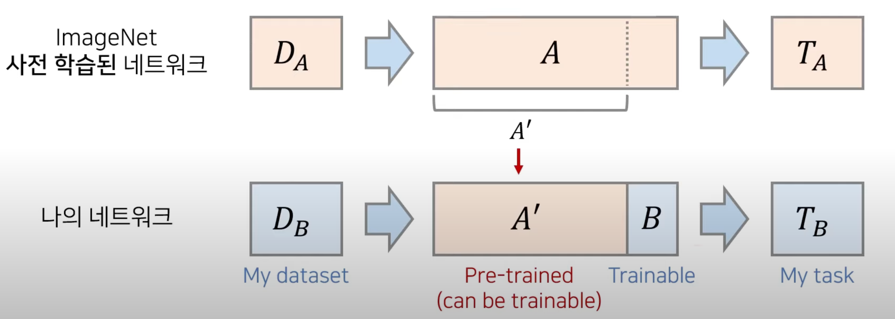
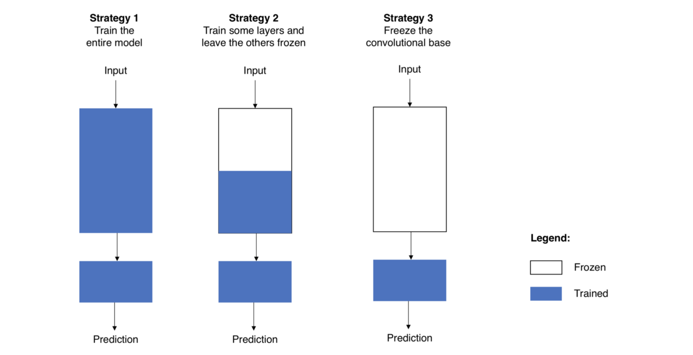

# 🦁 Transfer Learning

[참고 영상](https://www.youtube.com/watch?v=pBoClHDFamE&ab_channel=%EB%8F%99%EB%B9%88%EB%82%98)

## ✅ Transfer Learning
### - Transfer Learning 개요
* 한 분야
* 큰 크기의 $D_A$로 `사전 학습된(pre-trained)` CNN을 불러와 feature extractor의 가중치를 초기 가중치로 사용
* $T_A$ 와 $T_B$가 동일하지 않더라도 $D_A$ 와 $D_B$가 유사한 특징을 가진다면 `학습 속도 개선 및 정확도 향상` 
* 특히 $D_B$ 의 크기가 매우 작을 때에도 `높은 정확도`

[참고 영상](https://www.youtube.com/watch?v=pBoClHDFamE&ab_channel=%EB%8F%99%EB%B9%88%EB%82%98) 속 이미지

 

### - Transfer Learning 사용하는 이유
* 빠른 학습 수행
* 작은 데이터에 대해 학습할 때 오버피팅 예방

 

### - Transfer Learning 잘 되기 위한 조건
* 사전 학습에 사용된 데이터와 Task 데이터가 비슷한 형태를 가져야 함
* 일반적으로 Task 데이터보다 많은 데이터로 사전 학습이 수행됐어야 함

 

### - Transfer Learning의 두 가지 구현 방식
* 얼리기, Freezing
  * 앞부분의 레이어는 얼려서 학습하지 않고, 마지막 레이어(FC 레이어)만 학습
* 미세 조정, Fine-Tuning
  * 모든 레이어를 학습
  * 일반적으로 downstream task로 fine-tuning 하는 과정은 비교적 저렴
  * 작은 데이터 세트 및 적은 epoch로도 높은 정확도

 

### - Fine-Tuning 3가지 방법

[출처](https://eehoeskrap.tistory.com/186)  

 

|전략 1|전략 2|전략 3|
|:------:|:------:|:------:|
|모델 전체를 새로 학습|Convolution layer 일부분 고정(Freezing)|Convolution layer 고정(Freezing)   Classifier만 새로 학습|
|pretrained model 구조만 사용   task에 맞게 모델을 전부 새롭게 학습|낮은 레벨의 계층은 일반적이고 독립적인 특징 추출   높은 레벨의 계층은 보다 구체적이고 명확한 특징 추출   이런 특성을 고려하여 어느정도까지 재학습시킬 것인지 결정|컴퓨팅 연산 능력이 부족하거나   데이터 셋이 너무 작거나   task가 pretrained model의 데이터 셋과 매우 비슷할 때 사용|

* 상황 1 : 크기가 크고 유사성이 작은 데이터 셋
  * 전략 1, 전체 모델을 새로 학습
  * 데이터 셋의 크기가 크므로, 모델을 처음부터 내가 원하는대로 재학습 가능
  * 사전 학습 모델의 구조만 사용하고, 많은 데이터 셋을 이용하여 모델 학습
* 상황 2 : 크기가 크고 유사성도 높은 데이터 셋
  * 어떤 선택을 하던 상관 없음
  * 전략 2가 효과적
  * 데이터 셋이 크기 때문에 과적합 현상은 문제 되지 않음
  * 데이터 유사도가 높기 때문에 pre-trained 모델이 이전에 학습한 지식을 활용하는 것이 효과적
* 상황 3 : 크기가 작고 유사성도 작은 데이터 셋
  * 최악의 상황
  * 전략 2 선택
  * 하지만 몇 개의 층을 학습시키고, freezing 할지 알기 어려움
  * 많은 층 학습 ➡️ 과적합 가능성
  * 적은 층 학습 ➡️ 과소적합 가능성
  * 상황 2보다는 조금 더 깊은 계층까지 새로 학습
  * Agumentation도 하나의 방법
* 상황 4 : 크기가 작고 유사성이 높은 데이터 셋
  * 전략 3 선택
  * Convolution base 를 특징 추출기로 사용
  * classifier 부분만 변경하여 학습

[참고 자료](https://newindow.tistory.com/254)