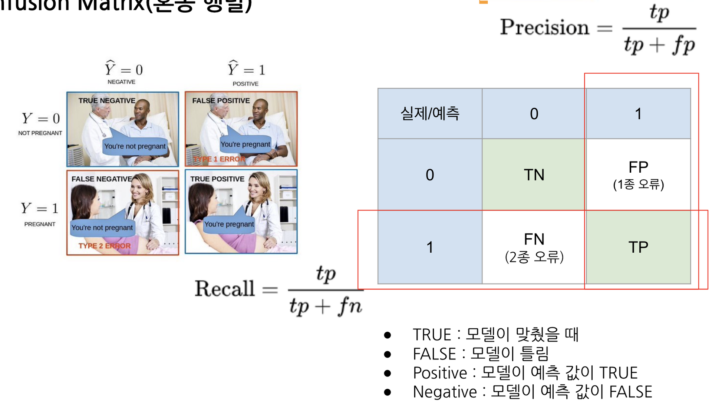

# 🦁 TIL

## ✅ Benz

[데이터 출처](https://www.kaggle.com/competitions/mercedes-benz-greener-manufacturing/data)

### - 선형 회귀 특징
[선형 회귀 공식 문서](https://scikit-learn.org/stable/modules/linear_model.html)
* 다른 모델들에 비해 간단한 작동 원리
* 매우 빠른 학습 속도
* 조정해줄 파라미터가 적음
* 이상치에 영향을 크게 받음
* 설명력이 떨어짐
* 데이터가 수치형 변수로만 이루어져 있을 경우, 경향성이 뚜렷할 경우 사용하기 좋음

<br>

### - 선형 회귀 모델의 단점 보완 모델
* `Ridge`
* `Lasso`
* `ElasticNet`


<br>

### - OneHotEncoder
* `handle_unknown="ignore"`
  * test에는 등장하지만 train에 존재하지 않는 것은 무시
  * feature의 기준은 train
  * test에 train에 없는 값이 있다면 그 값은 feature로 만들지 않음
  * test 컬럼에 있으나 train 컬럼에 없는 경우 train 에 없는 컬럼에 대해 인코딩 진행하지 않고 무시
* fit은 train에만 진행
* test는 transform만 진행
* `OneHotEncoder` 는 수치 데이터까지 인코딩 하므로 이를 제외하는 전처리 필요
* `pd.get_dummies()` 의 경우 이런 전처리 없어도 범주 데이터만 알아서 인코딩 진행
* `drop="first"`
  * 모든 변수의 첫 번째 feature drop
  * 카테고리가 하나만 있는 경우 완전히 삭제됨
* `drop="if_binary"`
  * 두 개의 범주가 있는 각 기능의 첫 번째 범주를 삭제, 1개 or 3개 이상의 범주가 있는 기능은 그대로 유지
* 사이킷런을 이용한 인코딩이 더 복잡하지만 numpy 와 pandas 의 데이터를 다루는 연습을 하기 좋음
```python
from sklearn.preprocessing import OneHotEncoder

ohe = OneHotEncoder(handle_unknown="ignore")
```

<br>

### - Hold-Out-Validation

* cross-validation 을 사용하지 않고 hold-out-validation 사용
  * hold-out-validation이 속도가 더 빠르다는 장점
  * 그 대신 신뢰도가 떨어짐
* train 과 valid 로 데이터 분리 
* valid 를 만드는 이유는 제출 전 어느 정도의 스코어가 나올지 확인하기 위함

```python
from sklearn.model_selection import train_test_split

X_train, X_valid, y_train, y_valid = train_test_split(X, y, test_size=0.2, random_state=42)
```

<br>

## ✅ Benz-Boosting
### - CPU vs GPU
* GPU는 Graphics Processing Unit의 약자로 일반적으로 그래픽 카드를 의미
* 딥러닝 알고리즘은 본질적으로 굉장히 많은 단순 사칙연산(행렬 곱셈 등)을 수행
* 단순 사칙 연산은 병렬화가 아주 쉽기 때문에, GPU를 통해 한꺼번에 여러 코어를 이용해 연산이 가능

<br>

* CPU도 계산 능력이 좋지 않은가?
* CPU에는 단순 사칙 연산을 담당할 수 있는 산술논리연산(ALU) 장치가 1개
* 복잡한 단일 계산에서는 GPU보다는 유리하지만, 병렬 작업에 불리하므로 GPU보다 딥러닝에서 성능이 떨어짐
* 따라서 CPU보다 단순 병렬 연산에 우수한 GPU를 딥러닝을 하면서 학습에 사용

<br>

### - Gradient descent, 경사 하강법
* 손실함수 그래프에서 값이 가장 낮은 지점으로 경사를 타고 하강
* 머신러닝에서 예측값과 정답값간의 차이가 손실함수인데 이 크기를 최소화시키는 파라미터를 찾기 위해 사용
* 기울기가 0이 되는 지점 = 손실함수가 최솟값(극소값)을 갖는 지점

<br>

### - GBM, Gradient Boosting Machine
* 회귀 또는 분류 분석을 수행할 수 있는 예측 모형
* 계산량이 상당히 많이 필요
* 하드웨어 효율적으로 구현 필요


<br>

### - GBT, Gradient Boosting Tree
[GradientBoostingRegressor 공식 문서](https://scikit-learn.org/stable/modules/generated/sklearn.ensemble.GradientBoostingRegressor.html)
* 트리를 이용한 앙상블 모델
* 내부적으로 여러 모델을 생성한 후 모델들을 종합해 최종 모델을 생성하는 방법론
* 앙상블, 부스팅 기법 사용
* 랜덤 포레스트와 달리 무작위성이 없음 ➡️ 이전 모델의 오차를 보완해서 순차적으로 만들기 때문
* 매개변수를 잘 조정해야 하고 훈련 시간이 김 ➡️ learning rate 조절로 보완 가능하나 성능 저하 가능성
* 데이터의 스케일에 구애받지 않음
* 고차원의 희소한 데이터에 잘 작동하지 않음


#### `ephoch`
* 학습 횟수
* `n_estimators` 와 비슷한 의미

#### `learning_rate`, `Step`, `Size`
* 학습률
* 너무 크면 최소점을 지나칠 수 있고
* 너무 작으면 극소점을 찾기까지 시간이 오래 걸림

> absolute loss를 잘 안쓰는 이유 
> * 미분을 해도 기울기의 값이 같음
> * 기울기 0인 지점을 찾아갈 수 없음 


#### parameters
* `loss` : 최적화시킬 손실 함수, default=’squared_error’
* `learning_rate` : 각 트리의 기여도를 제한
* `n_estimators` : 부스팅 단계를 지정
* `subsample` : 개별 기본 학습자를 맞추는 데 사용할 샘플의 비율


<br>

### - ExtraTree 
[ExtraTreesRegressor 공식 문서](https://scikit-learn.org/stable/modules/generated/sklearn.ensemble.ExtraTreesRegressor.html)
* 극도로 무작위화된 모델
* 랜덤 포레스트와 같이 후보 기능의 무작위 하위 집합 사용
* 가장 차별적인 임계값을 찾는 대신 각 후보 기능에 대해 임계값이 무작위로 그려짐
* 무작위로 생성된 임계값 중 가장 좋은 것이 분할 규칙으로 선택
* 일반적으로 모델의 편향 증가, 분산 감소

<br>

* 랜덤 포레스트보다 빠른 속도
* 랜덤 포레스트보다 더 많은 특성을 고려
* 랜덤 포레스트보다 미세한 성능 우위
* 랜덤 포레스트와 동일한 원리를 이용해 많은 특징 공유

#### parameters
* `criterion` : 분할의 품질 측정 기준
* `max_depth` : 트리 최대 깊이
* `min_samples_split` : 내부 노드를 분할하는 데 필요한 최소 샘플 수
* `max_features` : 최상의 분할을 찾을 때 고려해야 할 기능의 수

<br>

### - XGBoost
- xgboost는 GBT에서 병렬 학습을 지원하여 학습 속도가 빨라진 모델
- 기본 GBT에 비해 더 효율적이고, 다양한 종류의 데이터에 대응할 수 있으며 이식성이 높음
- 캐글 등 머신러닝 경연 대회에서 우승 후보들이 사용하는 도구로 성능이 아주 좋음
#### 특징 
* 모든 가능한 트리를 나열하여 최적 트리를 찾는 것은 거의 불가능
* 2차 근사식을 바탕으로 손실함수를 토대로 하나의 leaf로부터 가지를 늘려나가는 것이 효율적
* 손실 함수가 최대한 감소하도록 하는 split point(분할점)을 찾는 것이 XGBoost의 목표
* Hyper Parameter의 종류가 많음

#### 장점
* GBM 대비 빠른 수행시간 ➡️ 병렬 처리
* 과적합 규제 ➡️ 자체에 과적합 규제 기능으로 강한 내구성
* 분류, 회귀 광범위한 영역에서 뛰어난 예측 성능
* Early Stopping 기능
* 다양한 옵션을 제공 ➡️ Customizing 용이 


#### 단점
* GBM에 비해 좋은 성능을 보이지만 여전히 느린 학습 시간
* Hyper Parameter 튜닝을 하게되면 더 오래 걸림
* 모델의 Overfitting


<br>

### - lightgbm
- GOSS(Gradient based One Side Sampling), EFB(Exclusive Feature Bundling)를 적용
- XGBoost와 비교해 정확도는 유지하며, 학습 시간을 상당히 단축시킨 모델
- 트리 기준 분할이 아닌 리프 기준 분할 방식을 사용함
  - 트리의 균형을 맞추지 않고 최대 손실 값을 갖는 리프 노드를 지속적으로 분할
  - 깊고 비대칭적인 트리를 생성
  - 균형을 맞추지 않고 최대 손실 값(max delta loss)을 가지는 리프 노드를 지속적으로 분할
  - 트리가 깊어지고 비대칭적인 트리 구조를 생성하여 예측 오류 손실을 최소화


#### 특징
* 트리 기반 학습 알고리즘을 사용하는 그래디언트 부스팅 프레임워크
* GBT, GBDT, GBRT, GBM, MART 및 RF를 포함한 다양한 알고리즘을 지원
  * GBDT는 Feature의 차원이 높고 데이터의 크기가 클 경우, 많은 시간을 소비
  * 가능한 모든 분할 지점의 Information Gain을 추정하기 위해 모든 데이터 인스턴스를 탐색
* GOSS (Gradient based One Side Sampling) 기울기 기반 단측 샘플링
  * 많이 틀린 데이터 위주로 샘플링
  * 행을 줄이는 것
  * 데이터에서 큰 Gradient를 가진 모든 인스턴스를 유지
  * 작은 Gradient를 가진 인스턴스를 무작위로 Sampling을 수행함
  * Gradient가 크다는 것은 잔차값이 크다는 의미 
  * 대규모 데이터 인스턴스를 다루기 위한 것
* EFB (Exclusive Feature Bundling) 배타적 특성 묶음
  * 열을 줄이는 것
  * 대규모 Features 수를 다루기 위한 것
  * 열을 합쳐주면서 다른 의미를 가진 숫자 부여

    |feature1|feature2|feature_bundle|
    |:-----:|:-----:|:-----:|
    |0|2|5|
    |0|1|6|
    |3|0|3|
    |4|0|4|

#### 장점
* 더 빠른 훈련 속도와 더 높은 효율성
* 적은 메모리 사용량
* 더 나은 정확도
* 병렬, 분산 및 GPU 학습 지원
* 대규모 데이터를 처리


#### 단점
* 과적합에 민감
* 작은 데이터에 대해서 과적합 되기 쉬움

<br>

### - CatBoost
- 기존 알고리즘과 비교하여 순열 기반 대안을 사용하여 범주형 기능을 해결하려고 시도하는 그레디언트 부스팅 프레임워크를 제공
- 기존 GBT의 느린 학습 속도와 과대적합 문제를 개선한 모델
- category 타입으로 되어있으면 lightGBM, CatBoost에서 인코딩 없이 사용 가능
- catboost의 경우 `cat_features` 파라미터에 카테고리 형태의 피처들을 지정해 주어야 함


#### 장점
* 범주형 기능에 대한 기본 처리 (인코딩 불필요)
* 빠른 GPU
* 모델 및 기능 분석을 위한 시각화 및 도구
* 빠른 실행을 위해 무시 트리 또는 대칭 트리 사용
* 과적합을 극복하기 위해 순서가 있는 부스팅 사용
- 자체적으로 `grid_search()` 와 `randomized_search()`를 제공

> 성능이 낮은 장비에서 n_jobs=-1을 쓰면 노트북이 dead kernel 이 되는 현상이 있음
> - 성능이 낮은 장비거나 다른 작업이 많이 진행되고 있다면 n_jobs를 1로 설정하면 좀 나음


<br>

## ✅ `learning_rate` vs `n_estimator`

* `learning_rate`가 낮을 때, `n_estimator` 값을 높여 과적합 방지
* 그렇다고 `n_estimator` 값이 높다면 과적합 가능성

<br>

* `learning_rate`를 줄이면 가중치 갱신의 변동폭 감소
* 여러 학습기들의 결정 경계(decision boundary) 차이 감소
* `n_estimators` 를 늘린다면 생성하는 `weak learner` 증가
* `weak learner`이 많아진만큼 결정 경계(decision boundary)가 많아지면서 모델이 복잡해짐

<br>


* 부스팅 알고리즘에서 `n_estimators`와 `learning_rate`는 `trade-off` 관계
* n_estimators(또는 learning_rate)를 늘리고, learning_rate(또는 n_estimators)을 줄인다면 서로 효과가 상쇄


<br>

* `n_estimator`는 순차적으로 생성되기 때문에 학습횟수를 의미
* 부스팅 모델은 왜 오버피팅에 민감한가?
  * 이전 트리(이전 학습)가 다음 트리(다음 학습)에 영향을 주기 때문

<br>

### - 배깅 & 부스팅 시각화
* 배깅 모델은 시각화가 어려워 3rd party 도구를 이용하여 시각화
* 그마저도 개별 트리 시각화는 어려움

<br>

* 그런데 부스팅 모델은 시각화가 가능하다 왜 그럴까?
* 배깅모델은 병렬적으로 트리를 여러 개 생성, 부스팅은 순차적으로 생성하기 때문입니다. 


<br>


## ✅ SMOTE

### - 배경
* 클래스 불균형
  * 데이터에서 각 클래스의 개수 차이가 큰 현상
  * 분류 모델링 시 정확도 저하 요인 중 하나
  * 불균형 데이터로 생성한 예측 모형은 특정 클래스에 치우치거나, 적절한 평가에 어려움

<br>

### - 개념
* SMOTE(Synthetic Minority Over-sampling Technique)
* 오버샘플링 기법 중 하나
* 클래스 불균형을 해결하기 위한 방법 중 하나 
* 낮은 비율로 존재하는 클래스의 데이터를 최근접 이웃(K-NN) 알고리즘을 활용하여 새롭게 생성
* 오버샘플링 기법 중 단순 무작위 추출을 통해 데이터의 수를 늘리는 방법도 존재
  * 데이터를 단순하게 복사하기 때문에 과적합 문제가 발생하기도 함
* SMOTE는 알고리즘 기반으로 데이터를 생성하므로, 과적합 발생 가능성이 단순 무작위 방법보다 적음


<br>

## ✅ 이진 분류 평가 지표

* 1종 오류와 2종 오류는 `trade-off` 관계
* `Precision`
  * 예측값이 1인 것을 기준으로 계산
* `Recall`
  * 실제값이 1인 것을 기준으로 계산
* `f1-score`
  * `Precision` 과 `Recall` 의 조화 평균
  * 둘 다 중요헌 경우 지표로 사용