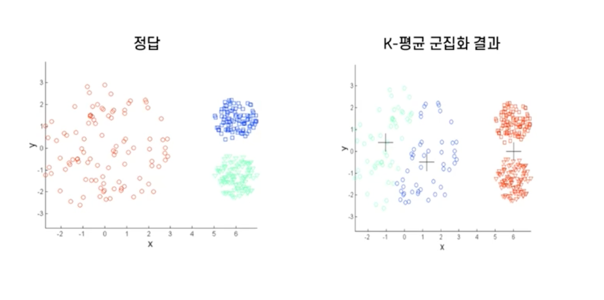
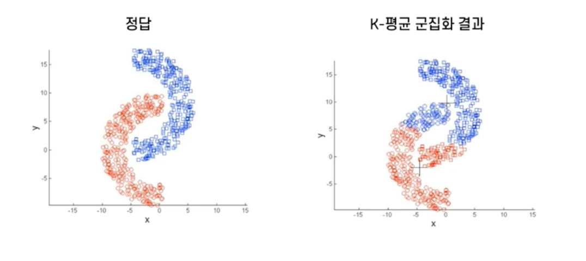

# 🦁 TIL

## ✅ Clustering, 군집화
### - Clustering 개념
* 유사한 속성들을 갖는 관측지들을 묶는 것
* 전체 데이터를 몇 개의 개인 군집으로 나누는 것

 

### - 군집화 기준
* 동일한 군집에 속한 관측지들은 서로 유사할수록 좋음
* 상이한 군집에 속한 관측지들은 서로 다를수록 좋음

 

### - `분류`, `Classification` vs `군집화`, `Clustering`
* `분류`, `Classification`
  * Supervised Learning
  * 사전에 정의된 범주가 있는 데이터로부터 예측 모델을 학습
* `군집화`, `Clustering`
  * Unsupervised Learning
  * 사전 정의된 범주가 없는 데이터에서 최적의 그룹을 찾아나가는 문제

 

### - 군집화 적용 사례
* 특성 별 고객 군집 (Segmentation)
* 유사 문서 군집화
* 서울시 미세먼저 농도 패턴 군집화
* 반도체 웨이퍼의 fail bit map 군집화

 

### - 군집화 유사도 척도
* 어떤 거리 척도를 사용하여 유사도를 측정할 것인가
* 단순하게 느낌이 비슷하네, 패턴이 비슷하네로 판단할 수 없음
* 데이터간 거리로 유사도 판단
  * 유클리디안 거리
    * 일반적으로 가장 많이 사용하는 거리 척도
    * 두 관측치 사이의 직선거리
    * 서로 다른 관측치 값 차이 제곱합의 제곱근
    * $d_{(X, Y)}=\sqrt{\sum_{i=1}^p(x_i-y_i)^2}$
  * 맨하탄 거리
    * $X$에서 $Y$로 이동 시 각 좌표축 방향으로만 이동할 경우 계산되는 거리
    * $d_{Manhattan(X, Y)}=\sum_{i=1}^p|x_i-y_i|$
  * 마할라노비스 거리
    * 변수 내 분산, 변수 간 공분산을 모두 반영하여 거리 계산
    * 데이터의 공분산행렬이 단위행렬일 경우 유클리디안 거리와 동일
    * $d_{Mahalanobis(X, Y)}=\sqrt{(X-Y)^T\sum^{-1}(X-Y)}$
    * $\sum^{-1}$ = Inverse of covariance matrix
  * 상관계수 거리
    * 데이터 간 피어슨 상관계수 값을 거리 척도로 직접 사용
    * 데이터 패턴의 유사도 및 비유사도를 반영할 수 있음

 

### - 군집화 알고리즘의 종류
* 분리형 군집화
  * 전체 데이터의 영역을 특정 기준에 의해 동시에 구분
  * 각 개체들은 사전에 정의된 개수의 군집 중 하나에 속하게 됨
* 계층적 군집화
  * 개체들을 가까운 집단부터 차근차근 묶어나가는 방식
  * 군집화 결과 뿐만 아니라 유사한 개체들이 결합되는 dendrogram도 생성
* 자기조직화 지도
  * 2차원의 격자에 각 개체들이 대응하도록 인공신경망과 유사한 학습을 통해 군집 도출
* 분포 기반 군집화
  * 데이터의 분포를 기반으로 높은 밀도를 갖는 세부 영역들로 전체 영역을 구분

 

## ✅ Hierarchical Clustering, 계층적 군집화
* 계층적 트리모형을 이용하여 개별 개체들을 유사도가 높은 순서로 통합
* 덴드로그램(dendrogram)으로 시각화 가능
  * dendrogram : 개체들이 결합되는 순서를 나타내는 트리형태 구조
* 사전에 군집의 수를 정하지 않아도 수행 가능
  * dendrogram 생성 후 적절한 수준에서 잘라 군집 생성

1. 모든 개체들 사이의 거리에 대한 유사도 행렬 계산
2. 거리가 인접한 관측치끼리 군집 형성
3. 유사도 행렬 업데이트
4. 과정 반복

* 핵심 수행 절차
  *  두 군집 사이의 유사도/거리 측정 방식
  *  방식에 따라 다른 군집화 결과르 보임
     * 단일 연결법(min), 완전 연결법(max), 평균 연결법

 

## ✅ K-means Clustering, K-평균 군집화
* 대표적 분리형 군집화 알고리즘
* 각 군집은 하나의 중심을 가짐 
* 각 개체는 가장 가까운 중심에 할당하는 것이 원칙
* 같은 중심에 할당된 개체들이 모여 하나의 군집을 형성
* 사전에 군집의 수 K를 정해줘야 함, Hyperparameter
* 설정된 중심과 데이터들 간의 거리의 합이 최소가 될 수 있도록 군집 형성

1. 초기 중심을 K개 임의로 설정
2. 개별 관측치로부터 각 중심까지의 거리 측정
3. 가장 가까운 중심이 이루는 군집에 관측치 할당
4. 각 군집의 중심을 다시 계산
5. 중심이 변하지 않을 때까지 2, 3의 과정을 반복
> 한계 : 초기 중심은 무작위로 생성하기 때문에 군집화 결과가 초기 중심 설정에 따라 다르게 나타나는 경우가 발생할 수도 있음

 

* 반복 수행으로 가장 여러 번 나타나는 군집 사용
* 일부 데이터만을 샘플링하여 군집화 후 초기 군집 중심 설정
* 데이터 분포 정보를 사용하여 초기 중심 설정
* 하지만 많은 경우 초기 중심 설정이 최종 결과에 큰 영향을 주지 않음

 

### - k-평균 군집화의 문제점
* 서로 다른 크기의 군집을 잘 찾아내지 못함

 

* 서로 다른 밀도의 군집을 잘 찾아내지 못함

 

* 지역적 패턴이 존재하는 군집을 판별하기 어려움

 

### - 최적의 군집 수 결정
* 다양한 군집 수에 대해 성능 평가 지표를 도시하여 최적의 군집 수 선택
* Elbow point에서 최적 군집 수가 결정되는 경우가 일반적

 

### - 군집화 결과 측정 및 평가
* 분류 알고리즘처럼 모든 상황에 적용 가능한 성능 평가 지표 부재
  * 내부 평가 지표
    * SSE
    * Silhouette
      * 일반적으로 0.5보다 크면 군집 결과가 타당
    * Dunn Index
  * 외부 평가 지표
    * Rand Index, Jaccard Coefficient, Folks and Mallows