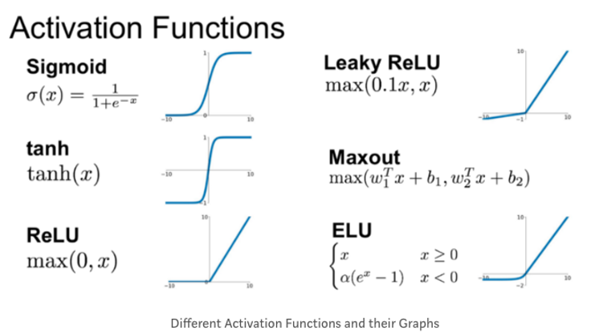

# 🦁 TIL

## ✅ Logistic Regression
* 데이터에 가장 잘 맞는 시그모이드 함수를 찾는 것
* 시그모이드 함수
  * $\frac{1}{1+e^{-x}}$
  * 무조건 0과 1사이의 값을 출력
  * $x$가 작으면 0에 가까워지고, $x$가 크면 1에 가까워짐
  * 이상치에 민감하게 반응하는 선형 회귀
* y가 범주형일 때 활용
  * Binary
  * Multi-class
  * 0과 1사이의 연속적인 값을 출력하기 때문에 로지스틱 분류가 아닌 로지스틱 회귀
  * 결과값이 0.5보다 큰지 작은지 보고 분류

> 비선형적인 패턴에 사용 불가능하다는 한계  
> 선형 분류를 위해 적절한 데이터 변환 필요

 

## ✅ Basic Structure
### - Logistic Regression to Neural Network
* 선형 분류기를 여러 겹으로 쌓으면 비선형 패턴을 학습할 수 있다는 것에서 시작
* 층마다 개별적으로 가중치를 곱하고 활성 함수를 취함
* 활성 함수
  * 선형 함수를 비선형적으로 바꿔줌
  * 2-Hidden Layer NN
    * $Y=a(W_2a(W_1X))$
  * 왜 층마다 비선형으로 바꿔주는가? 마지막 결과물에만 활성 함수를 취해주면 안되나?
    * $Y=a(W_2W_1X) = a(W_3X)$
    * $W_2W_1=W3$ 이라고 하면 로지스틱 회귀랑 다른게 없음
    * 선형 분류기 하나 사용한거랑 같음

 

## ✅ Multi-layered Structure
### - 활성 함수
  
[사진 출처](https://hwk0702.github.io/ml/dl/deep%20learning/2020/07/09/activation_function/)