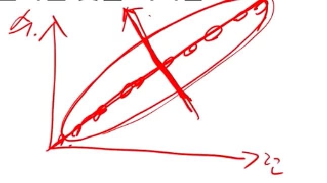

# 🦁 TIL

## ✅ PCA 소개
### - 기본 아이디어
* 자료에 중복된 정보가 많을 경우, 자료가 갖는 차원보다 더 작은 수의 차원으로도 자료에 내재한 정보를 설명할 수 있을 것

### - Unsupervised Learning
* `label`, $y$가 없는 데이터를 다룰 것이기 때문에 $x$에서 `feature`들을 학습해야 함
* 어떻게 하면 변수들을 좀 더 요약적으로 표현할 수 있을까, `feature extraction`
* 지도 학습은 feature와 label의 상관성, 관계를 학습

 

* 극단적인 예, 데이터가 아래와 같다면(4차원 데이터)
* 1, 2번 열만 사용하여 학습해도 충분할 것
* 실제 상황에선 완벽히 동일하진 않지만 상관관계가 큰 경우 존재 
    |1|2|3|4|
    |:---:|:---:|:---:|:---:|
    |1|4|1|4|
    |2|5|2|5|
    |3|6|3|6|

### - 주성분 분석(Principal Component Analysis, PCA)
* 처음 몇몇개의 차원이 정보를 최대한 많이 설명할 수 있도록 자료를 새로운 방향에서 바라보도록 하는 방법
* 데이터를 n개의 주성분으로 축소
* 한 각각의 성분은 다른 성분과는 상관이 없음
* 회귀분석과 같은 종속관계를 분석할 때 다중공선성을 없애는 이점

 

## ✅ PCA 원리
* 런닝머신을 잘 타면 수영도 잘한다.
  * 높은 상관관계 ➡️ 둘 중 하나만 학습에 써도 되지 않을까?
* 분산이 큰 축을 찾는 것이 중요
* 분산이 극단적으로 작을 경우 선형이 되고 데이터들을 구분할 수 있는 축이 되지 못함
  

 

> 벡터 $x$, $y$ 내적을 취하면, $y$가 $x$를 기준으로하는 축에서 얼마나 떨어져 있는지 알 수 있음  
* 분산을 가장 잘 설명하는 축 방향 벡터 정의
* 분산을 가장 잘 설명한다는 것은 해당 축으로 데이터를 사영 시켰을 때 사영 된 데이터의 분산이 가장 커짐을 의미
* 사영된 데이터들의 분산을 첫 주성분에 의해 설명되는 분산이라고 생각할 수 있음
* 첫 번째 축에 사영된 변수로 설명되지 않은 분산의 나머지 부분을 설명하는 두 번째 축 정의
* 첫 번째 축과 직교
* 이론상 축은 원래 데이터 차원의 개수만큼 찾을 수 있음
* 그러나 분산이 큰 방향을 내포하는 축들만 추려서 활용

 

## ✅ PCA 적용
1. 가장 먼저 데이터 정규화 해야 함 ➡️ 각 변수들의 평균 = 0
   * 왜 정규화가 필요한가
     * 원점을 기준으로 분산 계산
     * p축을 구하고 사영되는 것도 원점 기준
     * 사영을 시키기 전 평균을 0으로 만드는 것이 필요
2. 최적화 문제 정의
   * 새로운 축에 사영시킨 Z의 분산을 최대화하는 새로운 축을 찾는 것이 목표
3. 최적해 도출
4. 고유벡터들을 고유값 기준으로 내림차순 정렬
   * 각 고유벡터는 선형변환된 공간에서 서로 직교하는 새로운 축
5. 변수 추출을 통한 데이터 변환
6. 추출된 변수 중 일부만을 사용하여 데이터 역변환

### - Scree Plot
* 최적의 주성분 개수 정할 때 사용

### - Loading Plot
* 각 주성분을 만들 때, 기존 데이터 $X$의 각 변수가 기여하는 정도를 판단